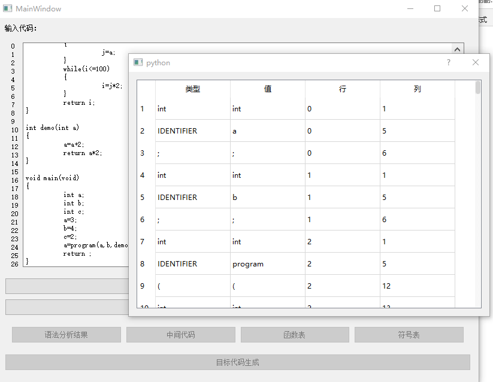
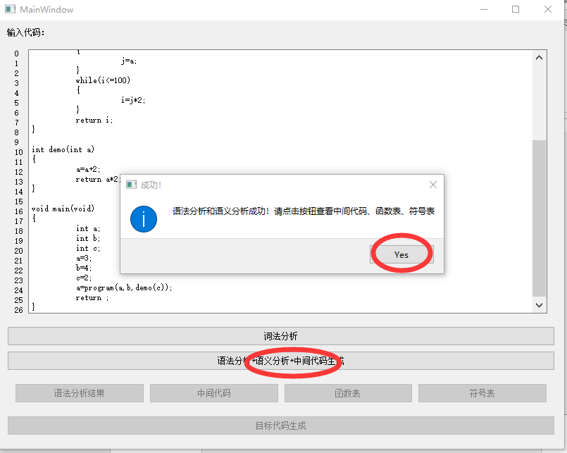
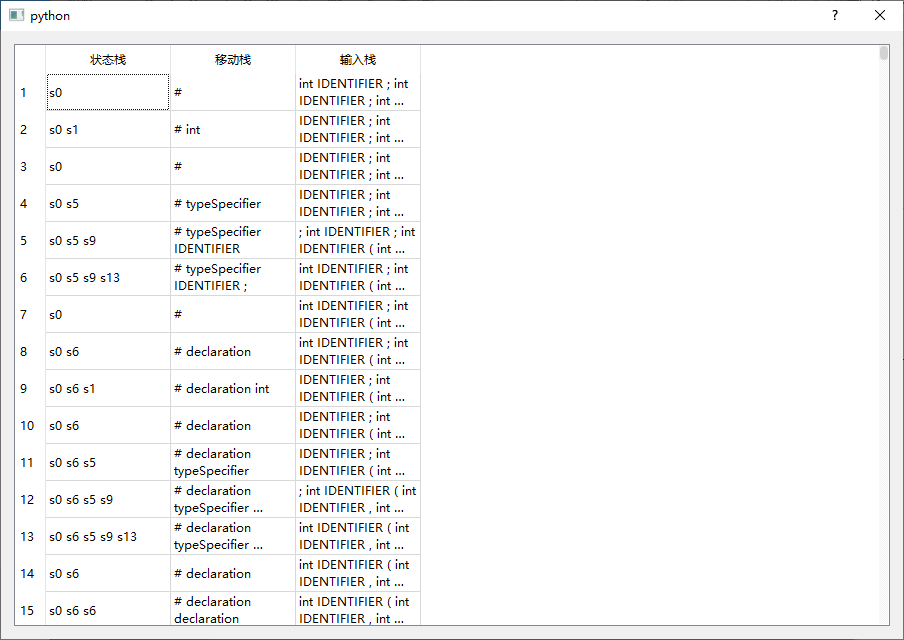
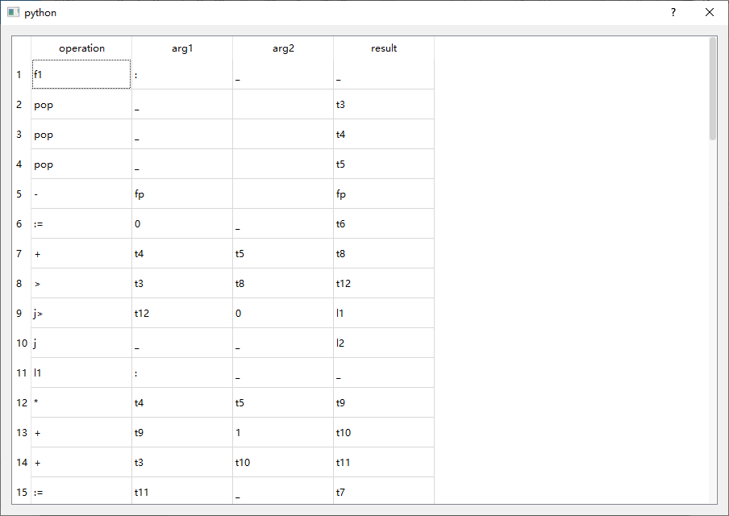
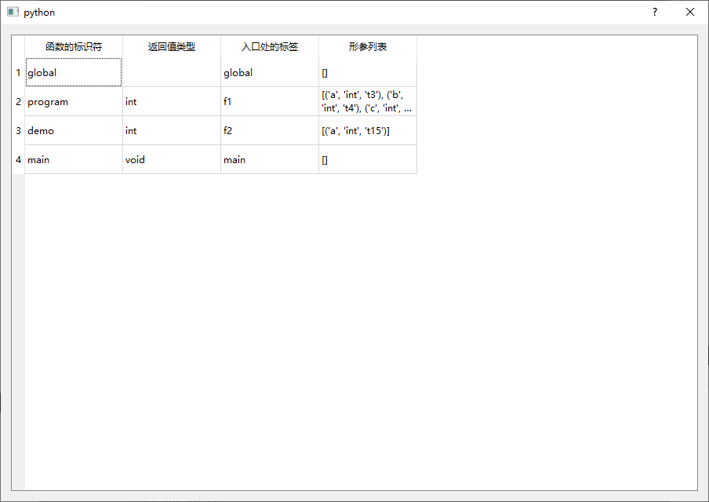
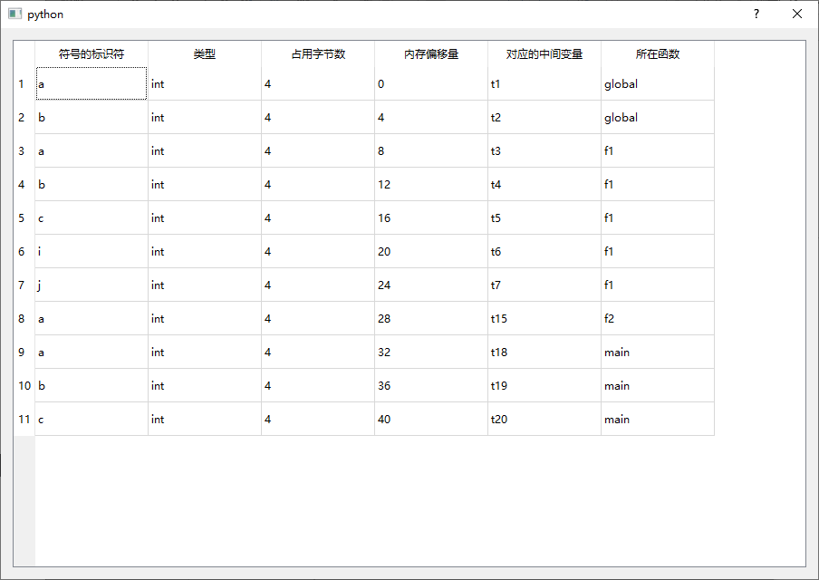
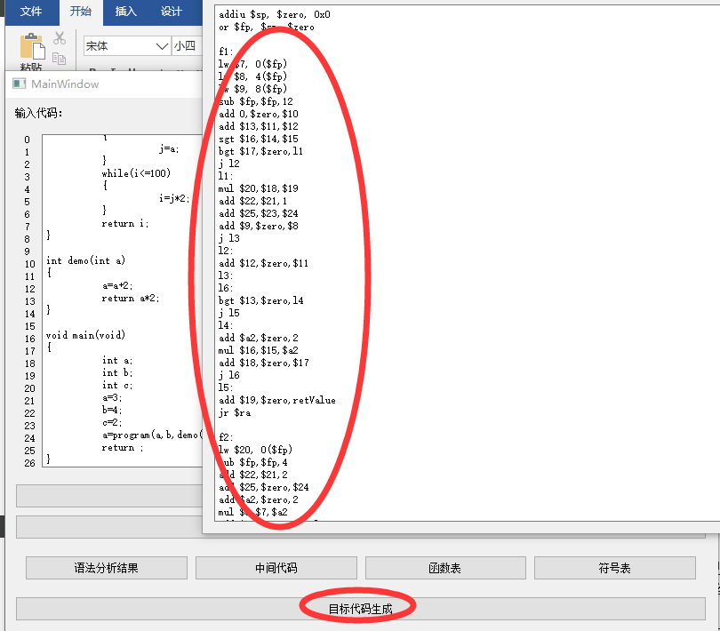
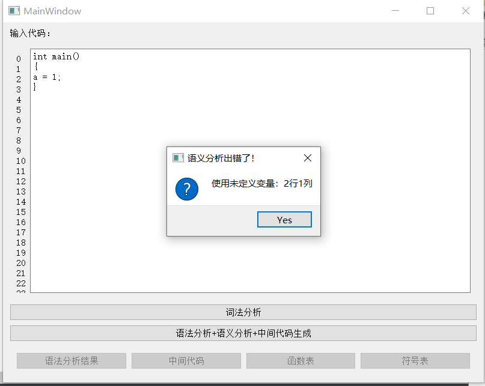

# LR-1-compiler-with-procedure-call-and-GUI

## 环境
* Python 3.7
* PyQt 5
* GUI: QT Creator 4.9.2

## 特点
* simplified C
* procedure call
* recognize empty generator

## 功能

## 错误提示

* 变量重定义
* 使用未声明的变量
* 使用未定义的函数
* 变量赋值时类型错误
* 函数形参和实参不匹配

